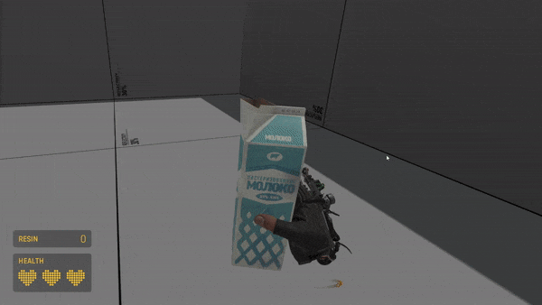
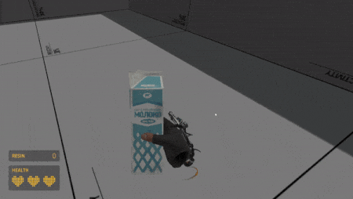

# HLA Custom Wrist Pocket Holograms

> This project is currently in Beta to make sure the way it works is suitable for the majority of developers. I am looking for feedback from developers implementing this system in their addon.

This project aims to solve the issue of wrist holograms for custom props appearing as health pen syringes. Any prop that can be stored inside the wrist can now have a matching icon with very minimal effort.

You can try the preview map on the workshop here: https://steamcommunity.com/sharedfiles/filedetails/?id=2637521776

## V2.0

Version 2 removes the requirement of creating custom models entirely. After adding the assets to your addon you can simply drop the prefab into your map and you're done. Any unregistered models placed into a wrist pocket will have their hologram dynamically generated via particle wizardry.
Custom hologram models are still supported and developers who want full control over the look and feel of their holograms are encouraged to follow the original methods in [Creating Hologram Models](docs/hologram_creation.md) and [Improving Hologram Models](docs/improving_models.md).

Overview of changes:

- Model creation is no longer required.
- Wrist icon attributes (e.g. colour) can be set through Hammer, at any point in-game.
- Rendering optimizations. Icons are only updated when necessary.
- Code optimizations. Updated to the latest standards.

## Installation

Head to the [releases section](https://github.com/FrostSource/hla-custom-wrist-pockets/releases/latest) or [Google Drive](https://drive.google.com/drive/folders/11QyH9kNEGCt-qOUVJtU5i7Zm1vtlMwUH?usp=sharing) to download the latest files.

Extract the downloaded zip directly into your addon content folder.

**Important:** Move the `scripts/` folder from your addon's content directory into your addon's game directory.

## Using

Contents:
1. [Setting Up The Script](docs/script_setup.md)
2. [Creating Hologram Models](docs/hologram_creation.md)
3. [Improving Hologram Models](docs/improving_models.md)

## Help

If something needs attention or you just need some help with using this project, please don't hesitate to [start an issue](https://github.com/FrostSource/hla-custom-wrist-pockets/issues/new) or join the [discord](https://discord.gg/tKrYtN3qbx)
