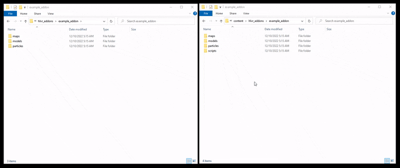

# HLA Custom Wrist Pocket Holograms

> This project is currently in Beta to make sure the way it works is suitable for the majority of developers. I am looking for feedback from developers implementing this system in their addon.

 

This project aims to solve the issue of wrist holograms appearing as health pen syringes for custom props. Any prop that can be stored inside the wrist can now have a matching icon with very minimal effort.

~~You can try the preview map on the workshop here: https://steamcommunity.com/sharedfiles/filedetails/?id=2637521776~~ Not updated until alpha ends.

## V2.0

Version 2 removes the requirement of creating custom models entirely. After adding the assets to your addon you can simply drop the prefab into your map and you're done. Any unregistered models placed into a wrist pocket will have their hologram dynamically generated via particle wizardry.
Custom hologram models are still supported and developers who want full control over the look and feel of their holograms are encouraged to follow the original methods in [Creating Hologram Models](docs/hologram_creation.md) and [Improving Hologram Models](docs/improving_models.md).

Overview of changes:

- Model creation is no longer required.
- Wrist icon attributes (e.g. colour) can be set through Hammer, at any point in-game.
- Rendering optimizations. Icons are only updated when necessary.
- Code optimizations. Updated to the latest standards.

## Installation

Head to the [releases section](https://github.com/FrostSource/hla-custom-wrist-pockets/releases/latest) or [Google Drive](https://drive.google.com/drive/folders/11QyH9kNEGCt-qOUVJtU5i7Zm1vtlMwUH?usp=sharing) to download the latest files.

Extract the downloaded zip directly into your addon content folder.

**Important:** Move the `scripts/` folder from your addons content directory into your addons game directory.

## Using

Drag `maps/prefabs/custom_wrist_pocket.vmap` into your map. For the basic system, you're done.

Attributes can be defined in Hammer to add some flair and customization.

The `AddAttribute` input can be sent to a storable prop with any of the following parameter overrides:

| Attribute | Description |
|---|---|
| wrist_white | Set the hologram color to white. |
| wrist_blue  | Set the hologram color to blue.  |
| wrist_green | Set the hologram color to green. |

Custom transforms can be set with the input `RunScriptCode` and the following parameter overrides:
| Code | Description |
|---|---|
| WristOrigin(x, y, z) | Set the local origin inside the wrist. Otherwise this is dynamically calculated.
| WristAngle(x, y, z) | Set the local angle the inside the wrist. Very useful for thin props.
| WristScale(x) | Set the local scale inside the wrist. Otherwise this is dynamically calculated.

See the [custom model transforms](docs/hologram_creation.md#rotationorigin) section for more information about the values to use for these.

## Guides

1. [Creating Hologram Models](docs/hologram_creation.md)
2. [Setting Up The Script](docs/script_setup.md)
3. [Improving Hologram Models](docs/improving_models.md)

## Help

If something needs attention or you just need some help with using this project, please don't hesitate to [start an issue](https://github.com/FrostSource/hla-custom-wrist-pockets/issues/new) or join the [discord](https://discord.gg/tKrYtN3qbx)
