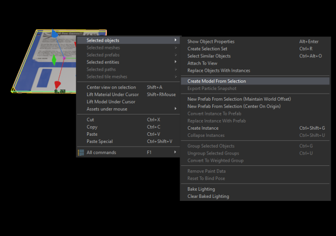
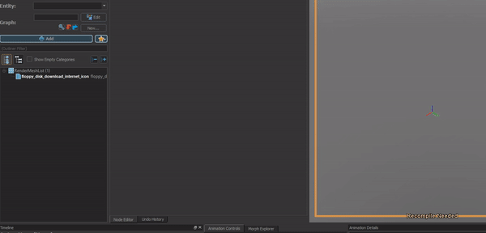
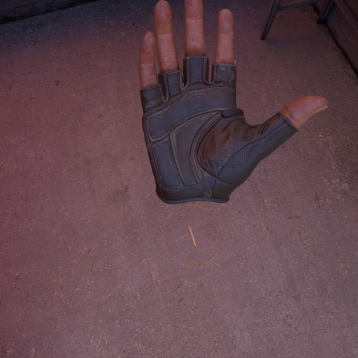
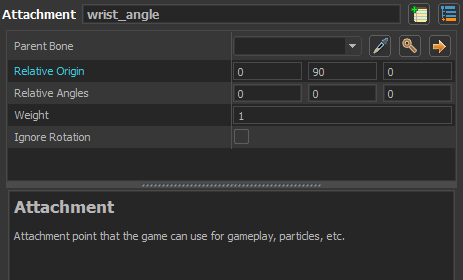
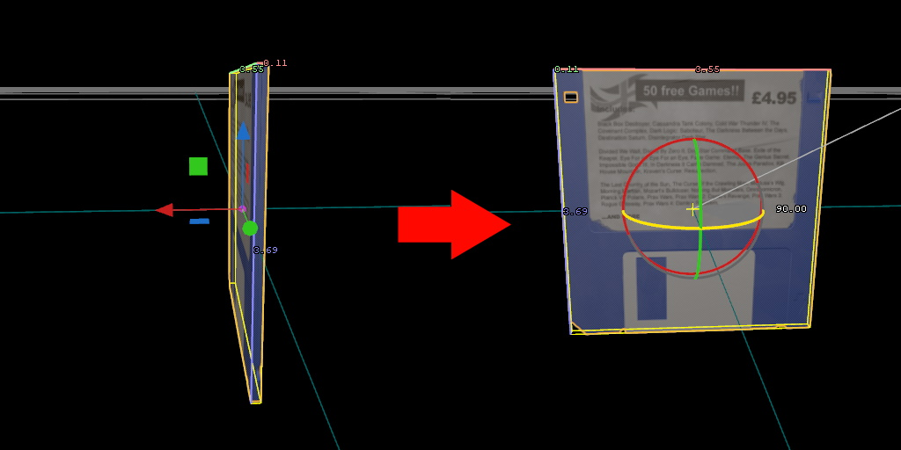
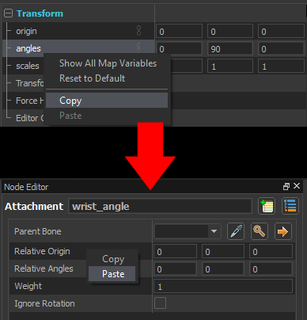

# Creating Hologram Models

**NOTE: Please read the paths in which the models are being saved carefully. If your hologram model is not displaying, double check that the paths are correct.**

A hologram model/icon is the visual representation of the prop stored stored inside the player's wrist. For accurate retrieval (the way it moves to the hand when being grabbed) this model should have the same shape and origin of the base model. The easiest way to do this is to create a new model from the base model in hammer through the right-click context menu:

We want to make sure to save it in the correct location. The hologram model path must match the base model path within a root directory named `custom_wrist_pocket`, and must have `_icon` appended to the model name.

The above floppy disk model is a base game model and has the path `models/props_discoverable/floppy_disk_download_internet.vmdl`

So we save our custom hologram model to `models/custom_wrist_pocket/props_discoverable/floppy_disk_download_internet_icon.vmdl`.

The script uses this predictable naming scheme to procedurally load the correct model at runtime.

Once created we can open the model with ModelDoc to add some useful changes ([if you've never used ModelDoc I recommend reading the wiki pages](https://developer.valvesoftware.com/wiki/Half-Life:_Alyx_Workshop_Tools/Modeling)).

## Hologram Material

To match the style of the base game the default material must be changed to a hologram style.

Add a DefaultMaterialGroup node and search for `wrist hologram` in the material picker. Although the built-in materials are specific to the item they should look fine for a simple model. There are also 3 plain sample materials included in `models/custom_wrist_pocket/materials/` which the example holograms use. For this model I'm choosing `models/custom_wrist_pocket/materials/orange_icon_hologram.vmat`.

## Rotation/Origin

Wrist icons face towards the positive Y axis when rotating towards the player head. The rotation of this base model means it faces an undesirable direction while in the wrist pocket:

    
To get our desired rotation we can add an `Attachment` called `wrist_angle` to tell the script how to rotate the model in real time:
    

`Relative Origin` should be used for your angles instead of `Relative Angles`. This may seem counter-intuitive but is the current method the script uses to calculate the angle.

### How do we find the correct angle for our model?

Inside Hammer, place your prop down and select it, then face the camera towards the negative Y axis (away from the green arrow) while looking at your model, then rotate it to face towards the camera. Copy the transform angles to the attachment origin.

### For models that aren't centered

This model has its origin centered so it doesn't need to be moved, but models with an off-center origin or odd bounding box design might appear strangely inside the wrist pocket. Version 2 of the script will automatically try to center the icon in-game, but if this does not work for your particular model there is an option similar to the angles.
Create a new attachment named `wrist_origin` and move its origin to the center of the model.

When you compile a model it is automatically detected by the tools which allows for rapid testing of your angles and origins without needing to recompile your map.

---

Feel free to examine all sample hologram icons to see how the attachments are used for different models.

# Registering The Hologram Model

See the [Registering Custom Models](script_setup.md) section for registering your new model with the system.
