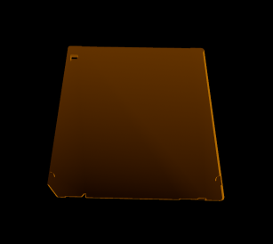
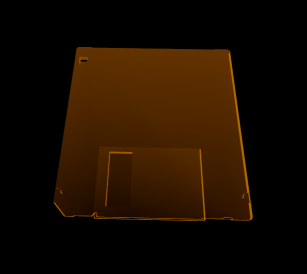
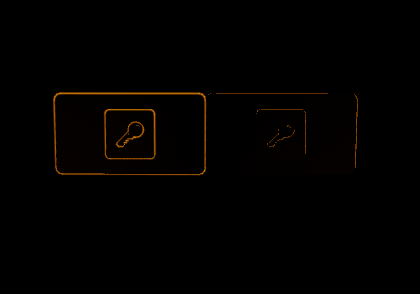
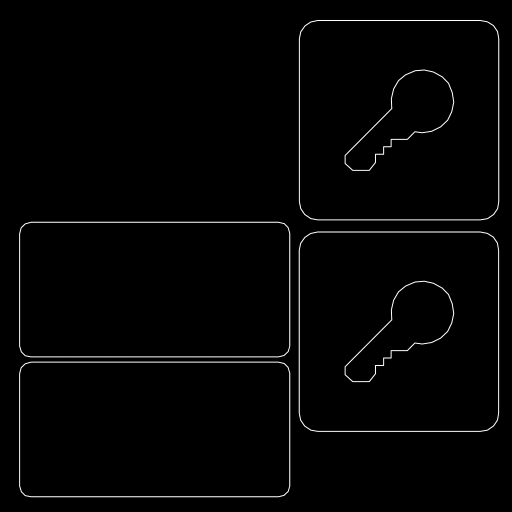

# Improving Hologram Models

Due to the way the hologram shader works, low detail and flat models can be hard to distinguish between when in the wrist pocket. The floppy disk used in [Creating Hologram Models](hologram_creation.md) is an example of this:

By modifying the mesh in Hammer or modelling software and adding some more basic geometry you can make the item more recognizable:

Timelapse example of this in Hammer:

## Improving Hologram Material

`Vr Wireframe Hologram` allows you to define the edges that should be highlighted using a grayscale mask for the color texture. If you have experience modifying/creating textures then this can be a simple way to add detail highlights.

An example of this with Valve's keycard hologram. Left is with a custom material and right is without:

Using this color texture:

