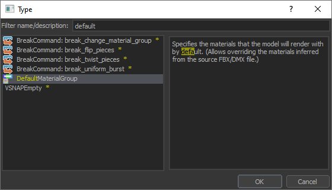

# HLA Custom Wrist Pocket Holograms

This project aims to solve the issue of wrist holograms for custom props appearing as health pen syringes. Any prop that can be stored inside the wrist can now have a matching icon with very minimal effort.

Contents:
1. [Setting Up The Script](hla-custom-wrist-pockets/script_setup.md)
2. [Creating Hologram Models](hologram_creation.md)
3. [Improving Hologram Models](improving_models.md)
