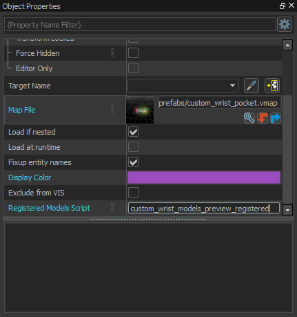

# Setting Up The Script

**NOTE: This is for developers who are creating their own custom hologram models. If you are using the version 2 dynamic holograms then you can skip this.**

Although the system is set up to be as user friendly for non-scripters as possible, at least one script needs to be modified to register your custom models. This file should be updated whenever you create a new hologram model.

## Registering Custom Models

Rename `scripts/vscripts/register_models_template.lua` to a unique name that will only exist for your addon so it won't clash with another addon using this system - a good method is the name of your addon followed by `_registered`. The example map uses `custom_wrist_models_preview_registered.lua`.

The template script contains all the code needed to register models, it just needs a list of your custom icons added.
Below is the template script on its own before any modifications.

```lua
require "wrist_pocket.core"

RegisterWristModels({
    -- Add your models here...
})
```

It's important that we only register the base model path, *not* the custom hologram model we have created.
For example... If we have created hologram icons for the following two base models:

```
models/props/ration_bar.vmdl
models/props/milk_carton_1.vmdl
```

We would add them to the script like so:

```lua
require "wrist_pocket.core"

RegisterWristModels({
    "models/props/ration_bar.vmdl",
    "models/props/milk_carton_1.vmdl"
})
```

Each line must be wrapped in quotes (either double `"` or single `'`) and end with a comma `,` or semi-colon `;`.

## Adding The Script To Your Map

Add the prefab `maps/prefabs/custom_wrist_pocket.vmap` to every map that should have custom wrist pocket models. Open the prefab properties and add the name of your script to the `Registered Models Script` property:


